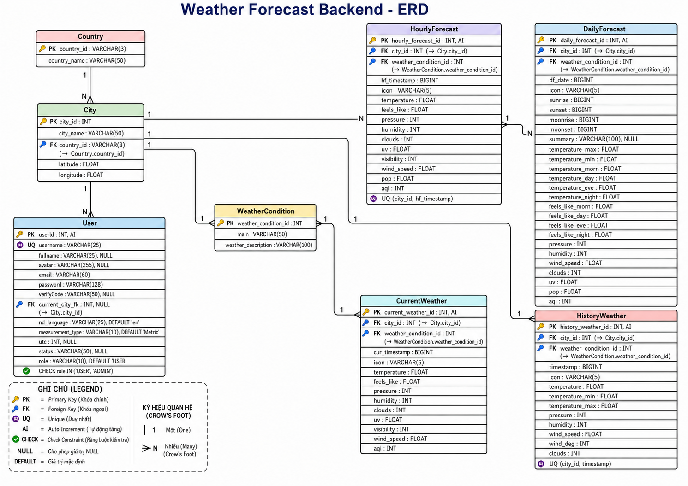

# Weather Forecast Website

Website dự báo thời tiết gồm 2 phần:

- `Weather-Forecast-FE`: frontend React + Vite.
- `Weather-Forecast-BE`: backend NestJS + TypeORM + MySQL.

## 1) Công nghệ sử dụng

### Frontend (FE)

- React 18 + Vite
- TypeScript
- React Router
- Axios
- Tailwind CSS
- Leaflet/React-Leaflet (bản đồ)
- i18next (đa ngôn ngữ)

### Backend (BE)

- NestJS 11
- TypeScript
- TypeORM
- MySQL (`mysql2`)
- JWT + Passport
- Cookie Parser (`httpOnly cookie` cho access/refresh flow)
- Class Validator / Class Transformer
- Cloudinary (upload avatar)
- OpenWeather API (dữ liệu thời tiết)

### Database

- Hệ quản trị: **MySQL**
- ORM: **TypeORM**
- Các bảng chính:
  - `User`
  - `Country`
  - `City`
  - `WeatherCondition`
  - `CurrentWeather`
  - `HourlyForecast`
  - `DailyForecast`
  - `HistoryWeather`

## 2) ERD (Database Diagram)

- Thư mục chứa ảnh ERD: `docs/erd/`
- File ảnh đề xuất: `docs/erd/weather-forecast-erd.png`

Khi đã có ảnh ERD, thêm vào markdown:

```md

```

## 3) Chức năng chính

- Xác thực người dùng:
  - Đăng ký, đăng nhập, đăng xuất
  - `me` (kiểm tra phiên hiện tại)
  - Refresh token qua cookie
- Quản lý thông tin user:
  - Lấy profile
  - Cập nhật avatar
  - Cập nhật fullname
  - Cập nhật current city theo tọa độ
- Tra cứu vị trí:
  - Gợi ý tên thành phố
  - Tìm city theo tọa độ
  - Lấy city theo id
- Dữ liệu thời tiết:
  - Current weather
  - Hourly forecast
  - Daily forecast
  - History weather
  - Endpoint tổng hợp `weather/full`
- Frontend:
  - Home, Login, Register
  - Dashboard (protected)
  - Map (protected)
  - Profile (protected)
  - Xử lý tự refresh khi 401 bằng interceptor

## 4) Kiến trúc thư mục

```text
WeatherForecast/
├─ Weather-Forecast-FE/
├─ Weather-Forecast-BE/
└─ docs/
   └─ erd/
```

## 5) Cấu hình môi trường

Tạo file `.env` trong `Weather-Forecast-BE`:

```env
PORT=3001
NODE_ENV=development
ADMIN_PASSWORD=admin123

DB_HOST=localhost
DB_PORT=3306
DB_USERNAME=root
DB_PASSWORD=your_password
DB_NAME=weather_forecast

JWT_SECRET=your_access_secret
JWT_REFRESH_SECRET=your_refresh_secret

OPENWEATHER_API_KEY=your_openweather_key

CLOUDINARY_CLOUD_NAME=your_cloud_name
CLOUDINARY_API_KEY=your_cloudinary_key
CLOUDINARY_API_SECRET=your_cloudinary_secret
```

Lưu ý:

- FE hiện đang gọi API ở `http://localhost:3001/api/v1`.
- CORS trong BE đang cho origin local frontend (xem `Weather-Forecast-BE/src/main.ts`).

## 6) Chạy dự án local

### Chạy Backend

```bash
cd Weather-Forecast-BE
npm install
npm run build
npm run start:dev
```

Seed dữ liệu mẫu:

```bash
npm run seed
```

### Chạy Frontend

```bash
cd Weather-Forecast-FE
npm install
npm run dev
```

## 7) Một số API chính

Base URL: `http://localhost:3001/api/v1`

- Auth:
  - `POST /auth/login`
  - `POST /auth/logout`
  - `POST /auth/refresh`
  - `GET /auth/me`
- User:
  - `POST /user`
  - `GET /user`
  - `PATCH /user/avatar`
  - `PATCH /user/fullname`
  - `PATCH /user/current-city/by-coordinates`
- City/Country:
  - `GET /city/suggest`
  - `GET /city/by-coordinates`
  - `GET /city/:city_id`
  - `GET /country`
  - `GET /country/:id`
- Weather:
  - `GET /weather?city_id=...`
  - `GET /weather/forecast/hourly?city_id=...`
  - `GET /weather/forecast/daily?city_id=...`
  - `GET /weather/history?city_id=...`
  - `GET /weather/full?city_id=...`
